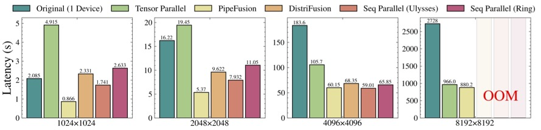
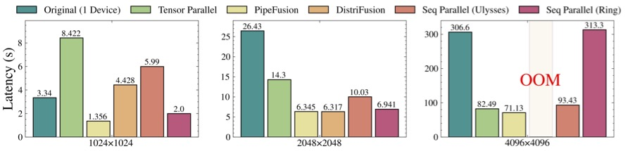
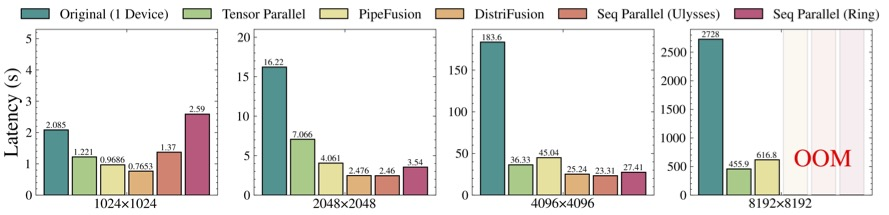
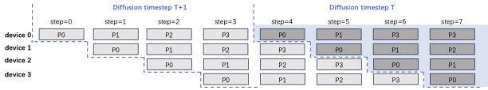

# PipeFusion: Displaced Patch Pipeline Parallelism for Inference of Diffusion Transformer Models

The project provides a suite of efficient parallel inference appoaches for Diffusion Models.
The backend networks of the diffusion model primarily include U-Net and Transfors (DiT). Both of these can be applied to DiT, and some methods can also be used for U-Net.

1. Tensor Parallelism. (DiT, U-Net)
2. Sequence Parallelism, including Ulysses and Ring Attention: (DiT)
3. Displaced Patch Parallelism, named [DistriFusion](https://arxiv.org/abs/2402.19481): (DiT, U-Net)
4. Displaced Patch Pipeline Paralelism, named PipeFusion, first proposed in this repo. (DiT)

The communication and memory cost of the above parallelism for DiT is listed in the following table. (* indicates comm. can be hidden by computation, but need extra buffer.)

<div align="center">

|          | attn-KV | communication cost | param | activations | extra buff |
|:--------:|:-------:|:-----------------:|:-----:|:-----------:|:----------:|
| Tensor Parallel | fresh | $4O(p \times hs)L$ | $\frac{1}{N}P$ | $\frac{1}{N}A$ | 0 |
| DistriFusion* | stale | $2O(p \times hs)L$ | $P$ | $A$ | $AL$ |
| Ring Seq Parallel* | fresh | NA | $\frac{1}{N}A$ | 0 | 0 |
| Ulysses Seq Parallel | fresh | $4O(p \times hs)L$ | $P$ | $\frac{1}{N}A$ | 0 |
| PipeFusion* | stale- | $O(p \times hs)$ | $\frac{1}{N}P$ | $\frac{1}{M}A$ | $\frac{A}{M}L$ |

</div>

The Latency on 4xA100 (PCIe)

<div align="center">
    
</div>

The Latency on 8xL20 (PCIe)

<div align="center">
    
</div>

The Latency on 8xA100 (NVLink)

<div align="center">
    
</div>

Best Practices:

1. PipeFusion is the best on both memory and communication efficiency. It dose not need high inter-GPU bandwidth, like NVLink. Therefore, it is lowest on latency for PCIe cluster. However, on NVLink, the power of PipeFusion is weakened.
2. DistriFusion is fast on NVLink at cost of large overall memory cost using, and threfore has OOM for high resolution images.
3. PipeFusion and Tensor parallelism is able to generate high resolution images due to their spliting on both parameter and activations. Tensor parallelism is fast on NVLink, while PipeFusion is fast on PCIe. 
4. Sequence Parallelism usually fast than tensor parallelis, but has OOM for 
high resolution images.


##  PipeFusion: Displaced Patch Pipeline Paralelism

### Overview

As shown in the above table, PipeFusion significantly reduces the memory usage and required communication bandwidth, not to mention it also hides communication overhead under the communication.
It is the best parallel approch for DiT inference to be hosted on GPUs connected via PCIe.

<div align="center">
    
</div>

The above picture compares DistriFusion and PipeFusion.
(a) DistriFusion replicates DiT parameters on two devices. 
It splits an image into 2 patches and employs asynchronous allgather for activations of every layer.
(b) PipeFusion shards DiT parameters on two devices.
It splits an image into 4 patches and employs asynchronous P2P for activations across two devices.


PipeFusion partitions an input image into $M$ non-overlapping patches.
The DiT network is partitioned into $N$ stages ($N$ < $L$), which are sequentially assigned to $N$ computational devices. 
Note that $M$ and $N$ can be unequal, which is different from the image-splitting approaches used in sequence parallelism and DistriFusion.
Each device processes the computation task for one patch of its assigned stage in a pipelined manner. 

The PipeFusion pipeline workflow when $M$ = $N$ =4 is shown in the following picture.

<div align="center">
    
</div>


### Usage

1. install [long-context-attention](https://github.com/feifeibear/long-context-attention) to use sequence parallelism

2. install pipefuison from local.
```
python setup.py install
```

3. Usage Example
In [./scripts/pixart_example.py](./scripts/pixart_example.py), we provide a minimal script for running DiT with PipeFusion.

```python
import torch

from distrifuser.pipelines import DistriPixArtAlphaPipeline
from distrifuser.utils import DistriConfig
from pipefusion.modules.opt.chunk_conv2d import PatchConv2d

distri_config = DistriConfig(height=1024, width=1024, warmup_steps=4)
pipeline = DistriPixArtAlphaPipeline.from_pretrained(
    distri_config=distri_config,
    pretrained_model_name_or_path=args.model_id,
)

# memory efficient VAE
PatchConv2d(1024)(pipeline)
pipeline.set_progress_bar_config(disable=distri_config.rank != 0)

output = pipeline(
        prompt="An astronaut riding a green horse",
        generator=torch.Generator(device="cuda").manual_seed(42),
        num_inference_steps=20,
        output_type="pil,
    )
if distri_config.rank == 0:
    output.save("astronaut.png")
```

## Benchmark

You can  adapt to [./scripts/benchmark.sh](./scripts/benchmark.sh) to benchmark latency and memory usage of different parallel approaches.

## Evaluation Image Quality

<div align="center">
    
</div>

### Procedure
#### Prerequisite
Firstly, Install the following additional dependencies before testing:
```
pip3 install datasets tensorflow scipy
```

#### Sample Batch Generation
Then you can use `scripts/generate.py` to generate images with COCO captions. An example command is as follow:
```
CUDA_VISIBLE_DEVICES=0,1,2,3 torchrun --nproc_per_node=4 --rdzv-endpoint=localhost:8070 scripts/generate.py --pipeline pixart --scheduler dpm-solver --warmup_steps 4 --parallelism pipeline --no_cuda_graph --dataset coco --no_split_batch --guidance_scale 2.0 --num_micro_batch 8.0
```

After that, you can use `scripts/npz.py` to pack the generated images into a `.npz` file, where the `$GENERATED_IMAGES_FOLODER` is the path you saved the generated images, while `$IMAGES_NUM` is the total images count:
```
python3 scripts/npz.py --sample_dir $GENERATED_IMAGES_FOLODER --num $IMAGES_NUM
```

#### Reference Batch Generation
To get the COCO ref images, you can run the following commands:
```
python3 scripts/dump_coco.py
```
Then you could use `scripts/npz.py` to pack the reference images into a `.npz` file as well, where the `$REF_IMAGES_FOLODER` is the path you saved the reference images, while `$IMAGES_NUM` is the total images count:
```
python3 scripts/npz.py --sample_dir $REF_IMAGES_FOLODER --num $IMAGES_NUM
```

#### Evaluate the results
After you completing the above procedure, you'll get two .npz files `$SAMPLE_NPZ` and `$REF_NPZ` (replace them with the corresponding files). You can evalute the results with `scripts/evaluator` by running:
```
python3 scripts/evaluator.py --ref_batch $REF_NPZ --sample_batch $SAMPLE_NPZ
```


## Other optimizations

1. Memory Efficient VAE: 

The VAE decode implementation from diffusers can not be applied on high resolution images (8192px).
It has CUDA memory spike issue, [diffusers/issues/5924](https://github.com/huggingface/diffusers/issues/5924). 
We fixed the issue by split image to conv operator in VAE by splitting the input feature maps into chunks.


## Cite Us
TBD