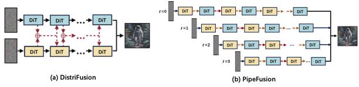
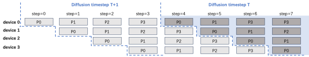

# PipeFusion: Displaced Patch Pipeline Parallelism for Inference of Diffusion Transformer Models

The project provides a suite of efficient parallel inference methods for Diffusion models. 

1. Tensor Parallelism.
2. Sequence Parallelism, including Ulysses and Ring Attention.
3. Displaced Patch Parallelism from DistriFusion.
4. Displaced Patch Pipeline Paralelism, named PipeFusion, first proposed in this repo.

The communication and memory cost of the above parallelism is listed in the following table.

|          | attn-KV | communication cost | param | activations | extra buff |
|----------|---------|-------------------|-------|-------------|------------|
| Tensor Parallel | fresh | $4O(p \times hs)L$ | $\frac{1}{N}P$ | $\frac{1}{N}A$ | 0 |
| DistriFusion* | stale | $2O(p \times hs)L$ | $P$ | $A$ | $AL$ |
| Ring Seq Parallel* | fresh | NA | $\frac{1}{N}A$ | 0 | 0 |
| Ulysses Seq Parallel | fresh | $4O(p \times hs)L$ | $P$ | $\frac{1}{N}A$ | 0 |
| PipeFusion* | stale- | $O(p \times hs)$ | $\frac{1}{N}P$ | $\frac{1}{M}A$ | $\frac{A}{M}L$ |

##  Displaced Patch Pipeline Paralelism.

### Overview

The above picture compares DistriFusion and PipeFusion.
(a) DistriFusion replicates DiT parameters on two devices. 
It splits an image into 2 patches and employs asynchronous allgather for activations of every layer.
(b) PipeFusion shards DiT parameters on two devices.
It splits an image into 4 patches and employs asynchronous P2P for activations across two devices.

PipeFusion partitions an input image into $M$ non-overlapping patches.
The DiT network is partitioned into $N$ stages ($N$ < $L$), which are sequentially assigned to $N$ computational devices. 
Note that $M$ and $N$ can be unequal, which is different from the image-splitting approaches used in sequence parallelism and DistriFusion.
Each device processes the computation task for one patch of its assigned stage in a pipelined manner. 

The Pipeline of $M$=$N$=4 Displaced Patch Pipeline Parallelism is shown in the following picture.

# Known Issues

1. Dit VAE decode has CUDA memory spike issue, [diffusers/issues/5924](https://github.com/huggingface/diffusers/issues/5924). 
So we set output_type='latent' to avoid calling vae decode by default.