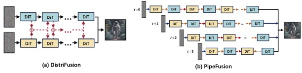

<div align="center">
<h1>PipeFusion: A Suite for Parallel Inference Diffusion Transformers (DiTs)</h1>

  <div align="center">
  <a href="https://opensource.org/licenses/Apache-2.0">
    
  </a>
  <a href="https://arxiv.org/abs/2405.14430">
    
  </a>
</div>
</div>

***In the Sora Era, still spend money on NVLink and high-bandwidth networks for serving long-context Diffusion Models? With PipeFusion, PCIe and Ethernet are enough!***

The project provides a suite of efficient parallel inference approaches for Diffusion Models.
The backend networks of the diffusion model primarily include U-Net and Transformers (DiT). Both of these can be applied to DiT, and some methods can also be used for U-Net.

1. Tensor Parallelism. (DiT, U-Net)
2. Sequence Parallelism, [USP](https://arxiv.org/abs/2405.07719) is a unified sequence parallel approach including DeepSpeed-Ulysses, Ring-Attention: (DiT)
3. Displaced Patch Parallelism, named [DistriFusion](https://arxiv.org/abs/2402.19481): (DiT, U-Net)
4. Displaced Patch Pipeline Paralelism, named [PipeFusion](https://arxiv.org/abs/2405.14430), first proposed in this repo. (DiT)

The communication and memory cost of the above parallelism for DiT is listed in the following table. (* indicates comm. can be hidden by computation, but needs extra buffers.)

<div align="center">

|          | attn-KV | communication cost | param | activations | extra buff |
|:--------:|:-------:|:-----------------:|:-----:|:-----------:|:----------:|
| Tensor Parallel | fresh | $4O(p \times hs)L$ | $\frac{1}{N}P$ | $\frac{2}{N}A = \frac{1}{N}QO$ | $\frac{2}{N}A = \frac{1}{N}KV$ |
| DistriFusion* | stale | $2O(p \times hs)L$ | $P$ | $\frac{2}{N}A = \frac{1}{N}QO$ | $2AL = (KV)L$ |
| Ring Sequence Parallel* | fresh | $2O(p \times hs)L$ | $P$ | $\frac{2}{N}A = \frac{1}{N}QO$ | $\frac{2}{N}A = \frac{1}{N}KV$ |
| Ulysses Sequence Parallel | fresh | $\frac{4}{N}O(p \times hs)L$ | $P$ | $\frac{2}{N}A = \frac{1}{N}QO$ | $\frac{2}{N}A = \frac{1}{N}KV$ |
| PipeFusion* | stale- | $2O(p \times hs)$ | $\frac{1}{N}P$ | $\frac{2}{M}A = \frac{1}{M}QO$ | $\frac{2L}{N}A = \frac{1}{N}(KV)L$ |

</div>

### Updates
* **June 26, 2024**: Support Stable Diffusion 3. The inference script is [scripts/sd3_example.py](./scripts/sd3_example.py).
* **May 24, 2024**: PipeFusion is public released. It supports PixArt-alpha [scripts/pixart_example.py](./scripts/pixart_example.py), DiT [scripts/ditxl_example.py](./scripts/ditxl_example.py) and SDXL [scripts/sdxl_example.py](./scripts/sdxl_example.py).

### Supported DiTs:
-  [PixArt-alpha](https://huggingface.co/PixArt-alpha/PixArt-alpha)
-  [Stable Diffusion 3](https://huggingface.co/stabilityai/stable-diffusion-3-medium-diffusers)
-  [DiT-XL](https://huggingface.co/facebook/DiT-XL-2-256) 


### Benchmark Results on Pixart-Alpha

You can  adapt to [./scripts/benchmark.sh](./scripts/benchmark.sh) to benchmark latency and memory usage of different parallel approaches.

1. The Latency on 4xA100-80GB (PCIe)

<div align="center">
    
</div>

2. The Latency on 8xL20-48GB (PCIe)

<div align="center">
    
</div>

3. The Latency on 8xA100-80GB (NVLink)

<div align="center">
    
</div>

4. The Latency on 4xT4-16GB (PCIe)

<div align="center">
    
</div>

##  PipeFusion: Displaced Patch Pipeline Parallelism

PipeFusion is the innovative method first proposed by us.

### Overview

PipeFusion significantly reduces memory usage and required communication bandwidth, not to mention it also hides communication overhead under the communication.
It is very suitable for DiT inference to be hosted on GPUs connected via PCIe.

<div align="center">
    
</div>

The above picture compares DistriFusion and PipeFusion.
(a) DistriFusion replicates DiT parameters on two devices. 
It splits an image into 2 patches and employs asynchronous allgather for activations of every layer.
(b) PipeFusion shards DiT parameters on two devices.
It splits an image into 4 patches and employs asynchronous P2P for activations across two devices.

PipeFusion partitions an input image into $M$ non-overlapping patches.
The DiT network is partitioned into $N$ stages ($N$ < $L$), which are sequentially assigned to $N$ computational devices. 
Note that $M$ and $N$ can be unequal, which is different from the image-splitting approaches used in sequence parallelism and DistriFusion.
Each device processes the computation task for one patch of its assigned stage in a pipelined manner. 

The PipeFusion pipeline workflow when $M$ = $N$ =4 is shown in the following picture.

<div align="center">
    
</div>


### QuickStart

1. install pipefuison from local.
```
python setup.py install
```

3. Usage Example
In [./scripts/pixart_example.py](./scripts/pixart_example.py), we provide a minimal script for running DiT with PipeFusion.

```python
import torch

from pipefuser.pipelines import DistriPixArtAlphaPipeline
from pipefuser.utils import DistriConfig
from pipefusion.modules.opt.chunk_conv2d import PatchConv2d

# parallelism choose from ["patch", "naive_patch", "pipefusion", "tensor", "sequence"],
distri_config = DistriConfig(
    parallelism="pipefusion",
    pp_num_patch=4
)

pipeline = DistriPixArtAlphaPipeline.from_pretrained(
    distri_config=distri_config,
    pretrained_model_name_or_path=args.model_id,
    enable_parallel_vae=True, # use patch parallel for VAE to avoid OOM on high-resolution image genration (2048px).
)

pipeline.set_progress_bar_config(disable=distri_config.rank != 0)

output = pipeline(
        prompt="An astronaut riding a green horse",
        generator=torch.Generator(device="cuda").manual_seed(42),
        num_inference_steps=20,
        output_type="pil,
    )
if distri_config.rank == 0:
    output.save("astronaut.png")
```

## Evaluation Image Quality

To conduct the FID experiment, follow the detailed instructions provided in the assets/doc/FID.md documentation.

<div align="center">
    
</div>


## Other optimizations

1. Avoid OOM in VAE module:

The [stabilityai/sd-vae-ft-mse](https://huggingface.co/stabilityai/sd-vae-ft-mse) adopted by diffusers bring OOM to high-resolution images (8192px on A100). A critical issue is the CUDA memory spike, as documented in [diffusers/issues/5924](https://github.com/huggingface/diffusers/issues/5924).

To address this limitation, we developed [DistVAE](https://github.com/PipeFusion/DistVAE), an innovative solution that enables efficient processing of high-resolution images. Our approach incorporates two key strategies:

* Patch Parallelization: We divide the feature maps in the latent space into multiple patches and perform parallel VAE decoding across different devices. This technique reduces the peak memory required for intermediate activations to 1/N, where N is the number of devices utilized.

* Chunked Input Processing: Building on [MIT-patch-conv](https://hanlab.mit.edu/blog/patch-conv), we split the input feature map into chunks and feed them into convolution operator sequentially. This approach minimizes temporary memory consumption.

By synergizing these two methods, we have dramatically expanded the capabilities of VAE decoding. Our implementation successfully handles image resolutions up to 10240px - an impressive 11-fold increase compared to the conventional VAE approach.

This advancement represents a significant leap forward in high-resolution image processing, opening new possibilities for applications in various domains of computer vision and image generation.


## Cite Us
```
@article{wang2024pipefusion,
      title={PipeFusion: Displaced Patch Pipeline Parallelism for Inference of Diffusion Transformer Models}, 
      author={Jiannan Wang and Jiarui Fang and Aoyu Li and PengCheng Yang},
      year={2024},
      eprint={2405.07719},
      archivePrefix={arXiv},
      primaryClass={cs.CV}
}
```

## Acknowledgenments
Our code is developed on [distrifuser](https://github.com/mit-han-lab/distrifuser) from MIT-HAN-LAB.
