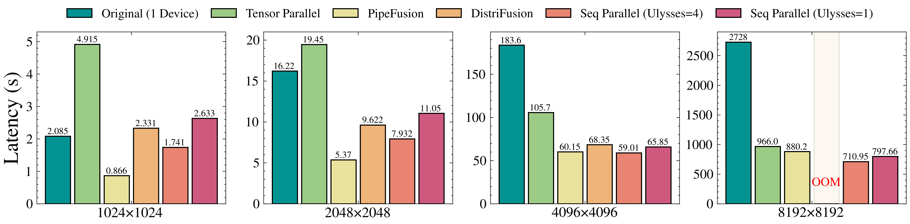
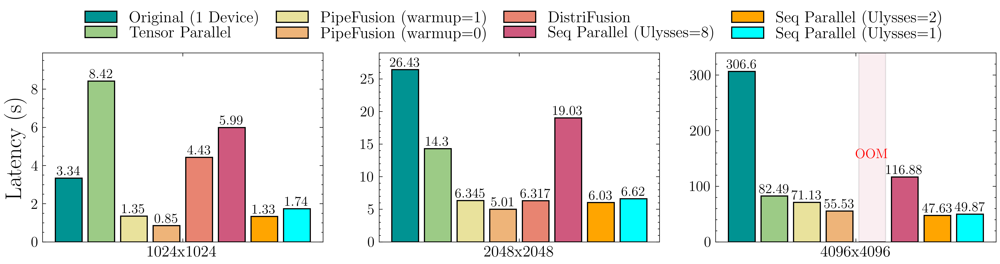
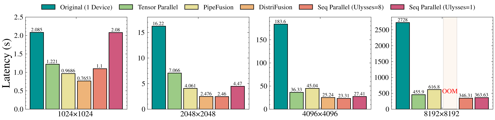
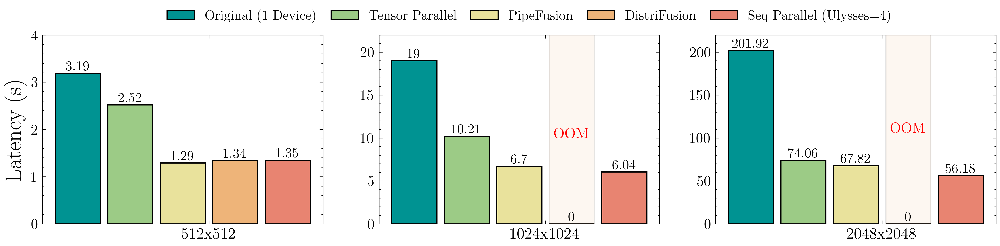
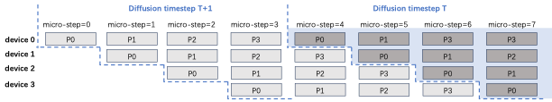
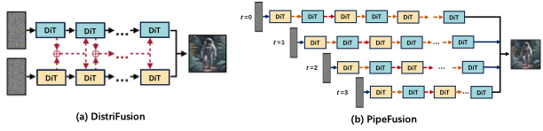
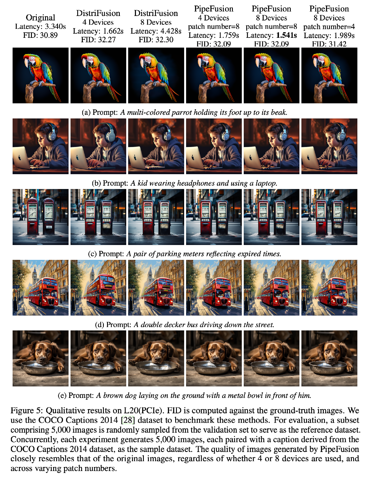

<div align="center">
<h1>xDiT: A Scalable Inference Engine for Diffusion Transformers (DiTs) on multi-GPU Clusters</h1>

  <div align="center">
  <a href="https://opensource.org/licenses/Apache-2.0">
    
  </a>
  <a href="https://arxiv.org/abs/2405.14430">
    
  </a>
</div>
</div>

***In the Sora Era, still spend money on NVLink and high-bandwidth networks for serving long-context Diffusion Models? With PipeFusion, PCIe and Ethernet are enough!***

The project provides a suite of efficient parallel inference approaches for Diffusion Models.
The backend networks of the diffusion model primarily include U-Net and Transformers (DiT). Both of these can be applied to DiT, and some methods can also be used for U-Net.

1. Tensor Parallelism. (DiT, U-Net)
2. Sequence Parallelism, [USP](https://arxiv.org/abs/2405.07719) is a unified sequence parallel approach including DeepSpeed-Ulysses, Ring-Attention: (DiT)
3. Displaced Patch Parallelism, named [DistriFusion](https://arxiv.org/abs/2402.19481): (DiT, U-Net)
4. Displaced Patch Pipeline Paralelism, named [PipeFusion](https://arxiv.org/abs/2405.14430), first proposed in this repo. (DiT)

The communication and memory cost of the above parallelism for DiT is listed in the following table. (* indicates comm. can be hidden by computation, but needs extra buffers.)

<div align="center">

|          | attn-KV | communication cost | param | activations | extra buff |
|:--------:|:-------:|:-----------------:|:-----:|:-----------:|:----------:|
| Tensor Parallel | fresh | $4O(p \times hs)L$ | $\frac{1}{N}P$ | $\frac{2}{N}A = \frac{1}{N}QO$ | $\frac{2}{N}A = \frac{1}{N}KV$ |
| DistriFusion* | stale | $2O(p \times hs)L$ | $P$ | $\frac{2}{N}A = \frac{1}{N}QO$ | $2AL = (KV)L$ |
| Ring Sequence Parallel* | fresh | $2O(p \times hs)L$ | $P$ | $\frac{2}{N}A = \frac{1}{N}QO$ | $\frac{2}{N}A = \frac{1}{N}KV$ |
| Ulysses Sequence Parallel | fresh | $\frac{4}{N}O(p \times hs)L$ | $P$ | $\frac{2}{N}A = \frac{1}{N}QO$ | $\frac{2}{N}A = \frac{1}{N}KV$ |
| PipeFusion* | stale- | $2O(p \times hs)$ | $\frac{1}{N}P$ | $\frac{2}{M}A = \frac{1}{M}QO$ | $\frac{2L}{N}A = \frac{1}{N}(KV)L$ |

</div>

### 📢 Updates
* 🎉**July 18, 2024**: Implemented hybrid parallelism support for PixArt-Sigma. The inference script is [examples/pixartsigma_example.py](examples/pixartsigma_example.py)
* 🎉**July 17, 2024**: Completed major project refactoring. Added hybrid parallelism support for PixArt-alpha. Support hybrid parallelism for PixArt-alpha. The inference script is [examples/pixartalpha_example.py](examples/pixartalpha_example.py)
* 🎉**July 10, 2024**: Support HunyuanDiT. The inference script is [legacy/scripts/hunyuandit_example.py](./legacy/scripts/hunyuandit_example.py).
* 🎉**July 1, 2024**: Split batch for Classifier Free Guidance.
* 🎉**June 26, 2024**: Support Stable Diffusion 3. The inference script is [legacy/scripts/sd3_example.py](./legacy/scripts/sd3_example.py).
* 🎉**May 24, 2024**: PipeFusion is public released. It supports PixArt-alpha [legacy/scripts/pixart_example.py](./legacy/scripts/pixart_example.py), DiT [legacy/scripts/ditxl_example.py](./legacy/scripts/ditxl_example.py) and SDXL [legacy/scripts/sdxl_example.py](./legacy/scripts/sdxl_example.py).


### 🎯 Supported DiTs:
-  [🔴 PixArt-Sigma](https://huggingface.co/PixArt-alpha/PixArt-Sigma-XL-2-1024-MS)
-  [🔵 HunyuanDiT-v1.2-Diffusers](https://huggingface.co/Tencent-Hunyuan/HunyuanDiT-v1.2-Diffusers)
-  [🟢 PixArt-alpha](https://huggingface.co/PixArt-alpha/PixArt-alpha)
-  [🟠 Stable Diffusion 3](https://huggingface.co/stabilityai/stable-diffusion-3-medium-diffusers)
-  [🔴 DiT-XL](https://huggingface.co/facebook/DiT-XL-2-256)


### Benchmark Results on Pixart-Alpha

You can  adapt to [./legacy/scripts/benchmark.sh](./legacy/scripts/benchmark.sh) to benchmark latency and memory usage of different parallel approaches.

1. The Latency on 4xA100-80GB (PCIe)

<div align="center">
    
</div>

2. The Latency on 8xL20-48GB (PCIe)

<div align="center">
    
</div>

3. The Latency on 8xA100-80GB (NVLink)

<div align="center">
    
</div>

4. The Latency on 4xT4-16GB (PCIe)

<div align="center">
    
</div>

##  PipeFusion: Displaced Patch Pipeline Parallelism

PipeFusion is the innovative method first proposed by us.

### Overview

PipeFusion significantly reduces memory usage and required communication bandwidth, not to mention it also hides communication overhead under the communication.
It is very suitable for DiT inference to be hosted on GPUs connected via PCIe.

<div align="center">
    
</div>

The above picture compares DistriFusion and PipeFusion.
(a) DistriFusion replicates DiT parameters on two devices. 
It splits an image into 2 patches and employs asynchronous allgather for activations of every layer.
(b) PipeFusion shards DiT parameters on two devices.
It splits an image into 4 patches and employs asynchronous P2P for activations across two devices.

PipeFusion partitions an input image into $M$ non-overlapping patches.
The DiT network is partitioned into $N$ stages ($N$ < $L$), which are sequentially assigned to $N$ computational devices. 
Note that $M$ and $N$ can be unequal, which is different from the image-splitting approaches used in sequence parallelism and DistriFusion.
Each device processes the computation task for one patch of its assigned stage in a pipelined manner. 

The PipeFusion pipeline workflow when $M$ = $N$ =4 is shown in the following picture.

<div align="center">
    
</div>


### QuickStart

1. Install xDiT from local.
```
python setup.py install
```

2. Usage

We provide several examples demonstrating how to run models with PipeFusion in the ./examples/ directory.

For instance, to view the available options for the PixArt-alpha example, use the following command:
```bash
python ./examples/pixartalpha_example.py -h

...

xFuser Arguments

options:
  -h, --help            show this help message and exit

Model Options:
  --model MODEL         Name or path of the huggingface model to use.
  --download-dir DOWNLOAD_DIR
                        Directory to download and load the weights, default to the default cache dir of huggingface.
  --trust-remote-code   Trust remote code from huggingface.

Runtime Options:
  --warmup_steps WARMUP_STEPS
                        Warmup steps in generation.
  --use_parallel_vae
  --seed SEED           Random seed for operations.
  --output_type OUTPUT_TYPE
                        Output type of the pipeline.

Parallel Processing Options:
  --do_classifier_free_guidance
  --use_split_batch     Use split batch in classifier_free_guidance. cfg_degree will be 2 if set
  --data_parallel_degree DATA_PARALLEL_DEGREE
                        Data parallel degree.
  --ulysses_degree ULYSSES_DEGREE
                        Ulysses sequence parallel degree. Used in attention layer.
  --ring_degree RING_DEGREE
                        Ring sequence parallel degree. Used in attention layer.
  --pipefusion_parallel_degree PIPEFUSION_PARALLEL_DEGREE
                        Pipefusion parallel degree. Indicates the number of pipeline stages.
  --num_pipeline_patch NUM_PIPELINE_PATCH
                        Number of patches the feature map should be segmented in pipefusion parallel.
  --attn_layer_num_for_pp [ATTN_LAYER_NUM_FOR_PP ...]
                        List representing the number of layers per stage of the pipeline in pipefusion parallel
  --tensor_parallel_degree TENSOR_PARALLEL_DEGREE
                        Tensor parallel degree.
  --split_scheme SPLIT_SCHEME
                        Split scheme for tensor parallel.

Input Options:
  --height HEIGHT       The height of image
  --width WIDTH         The width of image
  --prompt [PROMPT ...]
                        Prompt for the model.
  --no_use_resolution_binning
  --negative_prompt [NEGATIVE_PROMPT ...]
                        Negative prompt for the model.
  --num_inference_steps NUM_INFERENCE_STEPS
                        Number of inference steps.
```

Utilizing Various Parallelism Techniques You can leverage different types of parallelism to execute the model efficiently. It's crucial to ensure that the product of all parallel degrees equals the number of available devices. For example, you can employ a combination of split batch, PipeFusion parallel, and sequence parallel techniques with the following command to generate an image of a cute dog using hybrid parallelism::
```bash
torchrun --nproc_per_node=8 \
examples/pixartalpha_example.py \
--model models/PixArt-XL-2-1024-MS \
--pipefusion_parallel_degree 2 \
--ulysses_degree 2 \
--num_inference_steps 20 \
--warmup_steps 0 \
--prompt "A small dog" \
--use_split_batch
```
In this command, the equation ulysses_degree * pipefusion_parallel_degree * cfg_degree(use_split_batch) == number of devices == 8 is satisfied, allowing the hybrid parallelism to function correctly.

## Evaluation Image Quality

To conduct the FID experiment, follow the detailed instructions provided in the assets/doc/FID.md documentation.

<div align="center">
    
</div>


## Other optimizations

### 1. Avoid OOM in VAE Module:

The [stabilityai/sd-vae-ft-mse](https://huggingface.co/stabilityai/sd-vae-ft-mse) adopted by diffusers bring OOM to high-resolution images (8192px on A100). A critical issue is the CUDA memory spike, as documented in [diffusers/issues/5924](https://github.com/huggingface/diffusers/issues/5924).

To address this limitation, we developed [DistVAE](https://github.com/PipeFusion/DistVAE), an innovative solution that enables efficient processing of high-resolution images. Our approach incorporates two key strategies:

* Patch Parallelization: We divide the feature maps in the latent space into multiple patches and perform parallel VAE decoding across different devices. This technique reduces the peak memory required for intermediate activations to 1/N, where N is the number of devices utilized.

* Chunked Input Processing: Building on [MIT-patch-conv](https://hanlab.mit.edu/blog/patch-conv), we split the input feature map into chunks and feed them into convolution operator sequentially. This approach minimizes temporary memory consumption.

By synergizing these two methods, we have dramatically expanded the capabilities of VAE decoding. Our implementation successfully handles image resolutions up to 10240px - an impressive 11-fold increase compared to the conventional VAE approach.

This advancement represents a significant leap forward in high-resolution image processing, opening new possibilities for applications in various domains of computer vision and image generation.

### 2. Split Batch for Classifier-Free Guidance

During inference with classifier-free guidance, the batch size for inputs to DiT blocks remains fixed at 2. We prioritize batch parallelization before integrating other parallel strategies. For instance, on an 8-GPU setup, we can set a batch parallel degree of 2 and a pipefuse parallel degree of 4. This approach has resulted in a 1.7x speedup in generating 1024 x 1024 pixel images, using the same number of devices.

## Cite Us
```
@article{wang2024pipefusion,
      title={PipeFusion: Displaced Patch Pipeline Parallelism for Inference of Diffusion Transformer Models}, 
      author={Jiannan Wang and Jiarui Fang and Jinzhe Pan and Aoyu Li and PengCheng Yang},
      year={2024},
      eprint={2405.07719},
      archivePrefix={arXiv},
      primaryClass={cs.CV}
}
```

## Acknowledgenments
Our code is developed on [distrifuser](https://github.com/mit-han-lab/distrifuser) from MIT-HAN-LAB.
