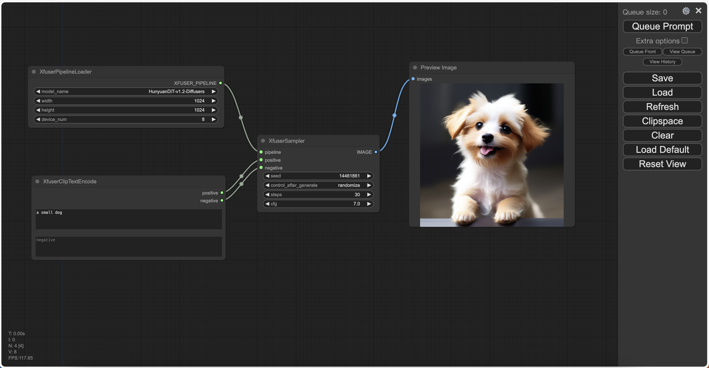

# xDiT ComfyUI Demo
## Environment
### Install xDiT
Follow the [QuickStart](https://github.com/xdit-project/xDiT?tab=readme-ov-file#QuickStart) in the xDiT repo to install the dependencies. You can simply install xDiT by running the following command:
```bash
git clone git@github.com:xdit-project/xDiT.git
cd xDiT
python setup.py install
```

### Install ComfyUI
Follow the [ComfyUI](https://github.com/comfyanonymous/ComfyUI) repo to install the dependencies.

You can simply install the dependencies by running the following command:
```bash
git clone https://github.com/comfyanonymous/ComfyUI
cd ComfyUI
pip install -r requirements.txt
```

### Put the comfyui-xdit folder into the ComfyUI/custom_nodes folder
You can put the comfyui-xdit folder into the ComfyUI/custom_nodes folder by running the following command, choose one of the following:
1. **Softlink(Recommended)**
```bash
cd ${ComfyUI}/custom_nodes
ln -s ${xDiT}/comfyui-xdit comfyui-xdit
```
2. Copy
```bash
cd ${ComfyUI}/custom_nodes
cp -r ${xDiT}/comfyui-xdit comfyui-xdit
```

## Prepare models checkpoint
Currently, we support the following pipelines in ComfyUI:
1. [xFuserPixArtAlphaPipeline](https://huggingface.co/PixArt-alpha/PixArt-alpha)
2. [xFuserPixArtSigmaPipeline](https://huggingface.co/PixArt-alpha/PixArt-Sigma-XL-2-1024-MS)
3. [xFuserFluxPipeline](https://huggingface.co/black-forest-labs/FLUX.1-schnell)
4. [xFuserStableDiffusion3Pipeline](https://huggingface.co/stabilityai/stable-diffusion-3-medium-diffusers)
5. [xFuserHunyuanDiTPipeline](https://huggingface.co/Tencent-Hunyuan/HunyuanDiT-v1.2-Diffusers)

Download the models and put them into the corresponding folder, take HunyuanDiT for example:
```bash
git lfs install
git clone https://huggingface.co/Tencent-Hunyuan/HunyuanDiT-v1.2-Diffusers
ln -s ${PWD}/HunyuanDiT-v1.2-Diffusers ${ComfyUI}/models/checkpoints/HunyuanDiT-v1.2-Diffusers
```

## Run the demo
You can run the demo by running the following command:
```bash
cd ${ComfyUI}
python main.py
```

You can load the default workflow in the comfyui-xdit/workflows folder: xdit-comfyui-demo.json


