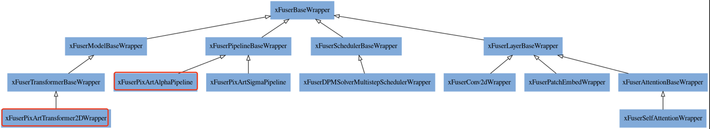

# Manual for Adding New Models
[Chinese Version](./Manual_for_Adding_New_Models_zh.md)

💡 Taking pixart-alpha as an example, the parallel version model supports the following full process

💡 Note: When directly using functions provided by the parent class for modification in `__call__` and `forward`, please be cautious. If the functions provided by the parent class cannot meet the requirements, you need to override the function yourself to make it compatible with the model.


# 0. Naming Conventions

- The **file names** of all models, schedulers, and layers in xDiT should be consistent with the names in the source library diffusers
- For xDiT Pipeline class wrappers, to be fully compatible with diffusers pipelines, their names should be `xFuser+OriginalName` without the `Wrapper` suffix. For example, if the pipeline name for pixart-alpha in diffusers is `PixArtAlphaPipeline`, then in xDiT it should be `xFuserPixArtAlphaPipeline`
- For wrapper names of classes other than Pipeline class, they should be `xFuser+OriginalName+Wrapper`. For example, if the backbone of pixart-alpha is `PixArtTransformer2D`, the wrapper name for this backbone in xDiT should be `xFuserPixArtTransformer2DWrapper`

The following diagram shows the calling relationships between different Classes in the xDiT project. If a new PixArt model is added, the added classes are circled in red.



# 1. Pipeline Class

The pipelines file directory is located at `xfuser/model_executor/pipelines`. Create a new file with the same name as the corresponding pipeline in the diffusers library (in this case, pipeline_pixart_alpha.py) in this directory, and write a pipeline wrapper class `xFuserPixArtAlphaPipeline` in it. This class needs to use the decorator `xFuserPipelineWrapperRegister.register`, which will register the correspondence between this pipeline wrapper and the original pipeline for later automatic parallelization.

The code is as follows:

```python
@xFuserPipelineWrapperRegister.register(PixArtAlphaPipeline)
class xFuserPixArtAlphaPipeline(xFuserPipelineBaseWrapper):

   @classmethod
    def from_pretrained(
        cls,
        pretrained_model_name_or_path: Optional[Union[str, os.PathLike]],
        engine_config: EngineConfig,
        **kwargs,
    ):
        pipeline = PixArtAlphaPipeline.from_pretrained(
            pretrained_model_name_or_path, **kwargs
        )
        return cls(pipeline, engine_config)

    @torch.no_grad()
    @xFuserPipelineBaseWrapper.enable_data_parallel
    @xFuserPipelineBaseWrapper.check_to_use_naive_forward
    def __call__(...

```

In the pipeline wrapper, only two functions need to be implemented. `from_pretrained` is used to forward parameters to the `from_pretrained` of the original pipeline class (in this case, `PixArtAlphaPipeline` in diffuser), obtain an original pipeline object, and pass it to `cls.__init__`. Then, during the layer-by-layer init process, its components will be gradually parallelized. This method is fully compatible with the diffusers interface.

The `__call__` method uses two decorators from `xFuserPipelineBaseWrapper`, which are essential and their order cannot be changed. Their functions are as follows:

- `enable_data_parallel`: Enables data parallelism (dp), automatically reads dp-related configurations and input prompts before **call**. When there are multiple prompts, they will be distributed to different dp ranks for execution. If there is only one input prompt, it has no effect.
- `check_to_use_naive_forward`: Performs parallel condition detection. If only data parallel is enabled, this decorator is used to perform naive forward inference on the input prompts.

💡 The order of decorators cannot be exchanged, otherwise data parallel will not be available when using naive forward.


## 1.1. **call** Modifications

The code logic in `__call__` is inherited from the `__call__` function of the corresponding pipeline in the diffusers library. You need to first copy the `__call__` function of the pipeline to the `__call__` of the corresponding wrapper, and then make further modifications.

💡  For example, for pixart-alpha, you need to first copy the `__call__` of the `PixArtAlphaPipeline` class in `diffusers/pipelines/pixart_alpha/pipeline_pixart_alpha.py` as the `__call__` of the `xFuserPixArtAlphaPipeline` class in `xfuser/model_executor/pipelines/pipeline_pixart_alpha.py`


1. Before encoding the input prompt, after calculating the batch size, use the width, height, and batch size of this inference to call `set_input_parameters` to set the input information for this forward pass, thereby calculating various runtime metadata in preparation for the formal forward pass.

```python
        ...
        # 2. Default height and width to transformer
        if prompt is not None and isinstance(prompt, str):
            batch_size = 1
        elif prompt is not None and isinstance(prompt, list):
            batch_size = len(prompt)
        else:
            batch_size = prompt_embeds.shape[0]
        device = self._execution_device

        # here `guidance_scale` is defined analog to the guidance weight `w` of equation (2)
        # of the Imagen paper: <https://arxiv.org/pdf/2205.11487.pdf> . `guidance_scale = 1`
        # corresponds to doing no classifier free guidance.
        do_classifier_free_guidance = guidance_scale > 1.0
# -------------------------- ADDED BELOW ------------------------------
        #* set runtime state input parameters
        get_runtime_state().set_input_parameters(
            height=height,
            width=width,
            batch_size=batch_size,
            num_inference_steps=num_inference_steps,
        )
# -------------------------- ADDED ABOVE ------------------------------
        # 3. Encode input prompt
        (
            prompt_embeds,
            prompt_attention_mask,
            negative_prompt_embeds,
            negative_prompt_attention_mask,
        ) = self.encode_prompt(
            prompt,
            do_classifier_free_guidance,
            negative_prompt=negative_prompt,
            num_images_per_prompt=num_images_per_prompt,
            device=device,
            prompt_embeds=prompt_embeds,
            negative_prompt_embeds=negative_prompt_embeds,
            prompt_attention_mask=prompt_attention_mask,
            negative_prompt_attention_mask=negative_prompt_attention_mask,
            clean_caption=clean_caption,
            max_sequence_length=max_sequence_length,
        )
        ...

```

1. Modify the `prompt_embeds` & `prompt_attention_mask` division in the case of `do_classifier_free_guidance`, determining the split batch situation.

```python
        ...
        # 3. Encode input prompt
        (
            prompt_embeds,
            prompt_attention_mask,
            negative_prompt_embeds,
            negative_prompt_attention_mask,
        ) = self.encode_prompt(
            prompt,
            do_classifier_free_guidance,
            negative_prompt=negative_prompt,
            num_images_per_prompt=num_images_per_prompt,
            device=device,
            prompt_embeds=prompt_embeds,
            negative_prompt_embeds=negative_prompt_embeds,
            prompt_attention_mask=prompt_attention_mask,
            negative_prompt_attention_mask=negative_prompt_attention_mask,
            clean_caption=clean_caption,
            max_sequence_length=max_sequence_length,
        )

#! ---------------------------- MODIFIED BELOW --------------------------------
        # * dealing with cfg degree
        if do_classifier_free_guidance:
            (
                prompt_embeds,
                prompt_attention_mask,
            ) = self._process_cfg_split_batch(
                prompt_embeds,
                prompt_attention_mask,
                negative_prompt_embeds,
                negative_prompt_attention_mask
            )

        #! ORIGIN
        # if do_classifier_free_guidance:
        #     prompt_embeds = torch.cat([negative_prompt_embeds, prompt_embeds], dim=0)
        #     prompt_attention_mask = torch.cat([negative_prompt_attention_mask, prompt_attention_mask], dim=0)
#! ---------------------------- MODIFIED ABOVE --------------------------------
        ...

```

1. Still special handling for classifier_free_guidance and split batch

```python
        # 6. Prepare extra step kwargs. TODO: Logic should ideally just be moved out of the pipeline
        extra_step_kwargs = self.prepare_extra_step_kwargs(generator, eta)

        # 6.1 Prepare micro-conditions.
        added_cond_kwargs = {"resolution": None, "aspect_ratio": None}
        if self.transformer.config.sample_size == 128:
            resolution = torch.tensor([height, width]).repeat(
                batch_size * num_images_per_prompt, 1
            )
            aspect_ratio = torch.tensor([float(height / width)]).repeat(
                batch_size * num_images_per_prompt, 1
            )
            resolution = resolution.to(dtype=prompt_embeds.dtype, device=device)
            aspect_ratio = aspect_ratio.to(dtype=prompt_embeds.dtype, device=device)

#! ---------------------------------------- MODIFIED BELOW ----------------------------------------
            if (
                do_classifier_free_guidance
                and get_classifier_free_guidance_world_size() == 1
            ):
                resolution = torch.cat([resolution, resolution], dim=0)
                aspect_ratio = torch.cat([aspect_ratio, aspect_ratio], dim=0)

            #! ORIGIN
            # if do_classifier_free_guidance:
            #     resolution = torch.cat([resolution, resolution], dim=0)
            #     aspect_ratio = torch.cat([aspect_ratio, aspect_ratio], dim=0)
#! ---------------------------------------- MODIFIED ABOVE ----------------------------------------

```

1. The model forward process needs to use synchronized pipeline for the first few diffusion steps, and then use asynchronous pipeline for the rest. The complex communication logic has been encapsulated in `xFuserPipelineBaseWrapper`, which can be called directly.
    - If the `_sync_pipeline` and `_async_pipeline` functions implemented in the base class are not compatible with the model, they need to be overridden in the current class and implemented separately referring to the code in the base class. This situation usually occurs when there is redundant communication logic.

```python
        # 7. Denoising loop
        num_warmup_steps = max(len(timesteps) - num_inference_steps * self.scheduler.order, 0)
#! ---------------------------------------- MODIFIED BELOW ----------------------------------------
        num_pipeline_warmup_steps = get_runtime_state().runtime_config.warmup_steps

        with self.progress_bar(total=num_inference_steps) as progress_bar:
            if (
                get_pipeline_parallel_world_size() > 1
                and len(timesteps) > num_pipeline_warmup_steps
            ):
                # * warmup stage
                latents = self._sync_pipeline(
                    latents=latents,
                    prompt_embeds=prompt_embeds,
                    prompt_attention_mask=prompt_attention_mask,
                    guidance_scale=guidance_scale,
                    timesteps=timesteps[:num_pipeline_warmup_steps],
                    num_warmup_steps=num_warmup_steps,
                    extra_step_kwargs=extra_step_kwargs,
                    added_cond_kwargs=added_cond_kwargs,
                    progress_bar=progress_bar,
                    callback=callback,
                    callback_steps=callback_steps,
                )
                # * pipefusion stage
                latents = self._async_pipeline(
                    latents=latents,
                    prompt_embeds=prompt_embeds,
                    prompt_attention_mask=prompt_attention_mask,
                    guidance_scale=guidance_scale,
                    timesteps=timesteps[num_pipeline_warmup_steps:],
                    num_warmup_steps=num_warmup_steps,
                    extra_step_kwargs=extra_step_kwargs,
                    added_cond_kwargs=added_cond_kwargs,
                    progress_bar=progress_bar,
                    callback=callback,
                    callback_steps=callback_steps,
                )
            else:
                latents = self._sync_pipeline(
                    latents=latents,
                    prompt_embeds=prompt_embeds,
                    prompt_attention_mask=prompt_attention_mask,
                    guidance_scale=guidance_scale,
                    timesteps=timesteps,
                    num_warmup_steps=num_warmup_steps,
                    extra_step_kwargs=extra_step_kwargs,
                    added_cond_kwargs=added_cond_kwargs,
                    progress_bar=progress_bar,
                    callback=callback,
                    callback_steps=callback_steps,
                    sync_only=True,
                )
#! ---------------------------------------- MODIFIED ABOVE ----------------------------------------

```

1. Output processing: Since only the last segment of the pipeline holds the generated results, set it so that only the last rank of each dp group returns data, while other ranks return None.

```python
        # 8. Decode latents (only rank 0)
#! ---------------------------------------- ADD BELOW ----------------------------------------
        if is_dp_last_group():
#! ---------------------------------------- ADD ABOVE ----------------------------------------
            if not output_type == "latent":
                image = self.vae.decode(latents / self.vae.config.scaling_factor, return_dict=False)[0]
                if use_resolution_binning:
                    image = self.image_processor.resize_and_crop_tensor(image, orig_width, orig_height)
            else:
                image = latents

            if not output_type == "latent":
                image = self.image_processor.postprocess(image, output_type=output_type)

            # Offload all models
            self.maybe_free_model_hooks()

            if not return_dict:
                return (image,)

            return ImagePipelineOutput(images=image)
#! ---------------------------------------- ADD BELOW ----------------------------------------
        else:
            return None
#! ---------------------------------------- ADD ABOVE ----------------------------------------

```

With this, the modifications in the pipeline are complete. At the pipeline's **call** level, it mainly handles the split batch situation for cfg. The modifications and communications related to pipeline parallel are encapsulated in _sync_pipeline and _async_pipeline, thus simplifying model modifications. However, when these functions in the base class cannot meet the model's requirements, they still need to be overridden and manually modified to ensure correctness.

# 2. Transformer Backbone Class

The transformer wrapper file directory is located at `xfuser/model_executor/models/transformers`. You can create a file with the same name as the transformer backbone in diffuser. In this example, the transformer is `PixArtTransformer2DModel`, located in the `pixart_transformer_2d.py` file in diffusers, so the wrapper file name is `xfuser/model_executor/models/transformers/pixart_transformer_2d.py`

The transformer backbone model also needs to undergo certain modifications, but there are few places that need to be changed, and they only involve special judgments for specific pp_ranks. It needs to use the `@xFuserTransformerWrappersRegister.register` decorator and implement two functions, `__init__` and `__forward__`. We will introduce them separately later.

```python
@xFuserTransformerWrappersRegister.register(PixArtTransformer2DModel)
class xFuserPixArtTransformer2DWrapper(xFuserTransformerBaseWrapper):
    def __init__(...

    @xFuserBaseWrapper.forward_check_condition
    def forward(...

```

## 2.1. `__init__` Modifications

In `__init__`, you need to specify which layers in the transformer model need to be wrapped, and if there are any additional parameters when wrapping.

```python
    def __init__(
        self,
        transformer: PixArtTransformer2DModel,
    ):
        super().__init__(
            transformer=transformer,
            submodule_classes_to_wrap=[nn.Conv2d, PatchEmbed],
            submodule_name_to_wrap=["attn1"],
        )

```

- Just pass in the layer class (`submodule_classes_to_wrap`) or its submodule name (`submodule_name_to_wrap`) that needs to be wrapped. Usually, this doesn't need to be changed.

## 2.2. `__forward__` Modifications

`__forward__` still only needs to make a few modifications to the original model's forward in diffusers/transformers. Please compare the commented out and newly added parts yourself.

1. Change the way to get height / width, because in the patch case, accurate height & width cannot be obtained directly through hidden_state.
2. Set only pp_rank 0 to perform pos_embed

```python
        # 1. Input
        batch_size = hidden_states.shape[0]
#! ---------------------------------------- MODIFIED BELOW ----------------------------------------
        #* get height & width from runtime state
        height, width = self._get_patch_height_width()
        #* only pp rank 0 needs pos_embed (patchify)
        if is_pipeline_first_stage():
            hidden_states = self.pos_embed(hidden_states)

        #! ORIGIN
        # height, width = (
        #     hidden_states.shape[-2] // self.config.patch_size,
        #     hidden_states.shape[-1] // self.config.patch_size,
        # )
        # hidden_states = self.pos_embed(hidden_states)
#! ---------------------------------------- MODIFIED ABOVE ----------------------------------------

```

1. At the end of each diffusion step, unpatchify needs to be performed to convert the hidden state in token form used in attention back to the image in latent space. We only let the last pp_rank do this operation.

```python
        # 3. Output
        #* only the last pp rank needs unpatchify
#! ---------------------------------------- ADD BELOW ----------------------------------------
        if is_pipeline_last_stage():
#! ---------------------------------------- ADD ABOVE ----------------------------------------
            shift, scale = (
                self.scale_shift_table[None] + embedded_timestep[:, None].to(self.scale_shift_table.device)
            ).chunk(2, dim=1)
            hidden_states = self.norm_out(hidden_states)
            # Modulation
            hidden_states = hidden_states * (1 + scale.to(hidden_states.device)) + shift.to(hidden_states.device)
            hidden_states = self.proj_out(hidden_states)
            hidden_states = hidden_states.squeeze(1)

            # unpatchify
            hidden_states = hidden_states.reshape(
                shape=(-1, height, width, self.config.patch_size, self.config.patch_size, self.out_channels)
            )
            hidden_states = torch.einsum("nhwpqc->nchpwq", hidden_states)
            output = hidden_states.reshape(
                shape=(-1, self.out_channels, height * self.config.patch_size, width * self.config.patch_size)
            )
#! ---------------------------------------- ADD BELOW ----------------------------------------
        else:
            output = hidden_states
#! ---------------------------------------- ADD ABOVE ----------------------------------------

```

# 3. Scheduler

The scheduler samples the results of each diffusion step. There are many types of schedulers, such as DDIM, DPM, etc. For different schedulers, we only need to modify one member function `step` of the scheduler class.

In the current framework, parallelization transformation for mainstream schedulers has been implemented. If using an unimplemented scheduler, there will be a `ValueError: Scheduler is not supported by xFuser` error at runtime, and support for the scheduler needs to be added separately.

An example file is located at `xfuser/model_executor/schedulers/scheduling_dpmsolver_multistep.py`, with modification markers at the corresponding positions in the file. You can try to directly move the corresponding logic to the newly added scheduler.

This part of the logic is to temporarily store the model_output in the patch case, updating the corresponding patch position by slicing a complete tensor, thereby achieving equivalence with single-device operation.

# 4. Layers

The Layers (torch.nn.Module derived classes) that need parallel transformation in DiT are mainly concentrated in the Attention Layer, such as SelfAttention. If U-Net convolution is used, it also needs parallel transformation, but convolution is rarely used in DiT.

The transformation of Layers needs to handle Stale states, such as Stale KV in Attention. This part of the logic is complex and coupled with PipeFusion and Sequence Parallel logic. If the model needs to add other layers, please refer to the existing layers in the `xfuser/model_executor/layers` directory for modifications.

Currently, the framework has supported `Conv2d` and `PatchEmbed` layers, which are used in the `pos_embed` layer of the transformer backbone and the convolution operations needed internally. The attention implementation backend in the diffuser library will have different specific implementations of Attention, called processors. Due to workload reasons, it is impossible to complete changes for all processors at once. Currently, parallelized versions of `AttnProcessor2_0` and `JointAttnProcessor2_0` have been implemented.

A new model added may require support for new processor implementations. If the Attention processors of the newly added model are not supported, a runtime error will occur: `ValueError: Attention Processor class xxx is not supported by xFuser`. If you encounter this situation, please try to complete the support or raise an issue in the code repository so that the model can get support as soon as possible.

Since the parallelization methods for different layers in different positions of the model are different, it is impossible to achieve uniformity. If you have any questions, please consult the xDiT maintainer.

💡 All the above modification markers exist in the pixart-alpha related source code files of the xDiT project. It is recommended to directly refer to the modification markers in them for adapting new models.
