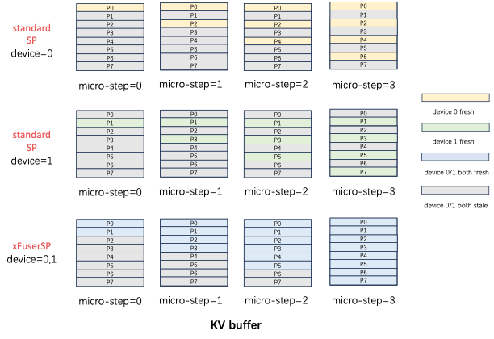

## Hybrid Parallelism
[Chinese Version](./hybrid_zh.md)

The design goal of xDiT is to scale the DiT inference process to ultra-large scales, such as multiple machines and multiple GPUs interconnected with heterogenous networks, i.e. Ethernet and PCIe. Individual parallel methods, such as PipeFusion or Sequence Parallelism (SP), struggle to achieve this simultaneously, making the combination of different parallel methods necessary.

xDiT supports four parallel methods: PipeFusion, Sequence, Data, and CFG Parallel. Among these, Data and CFG Parallel are relatively simple for inter-image parallelism, while PipeFusion and SP are more complex for parallelism within different patches of an image. The ability to combine these two parallel methods is one of the innovations of xDiT.

PipeFusion leverages the characteristic of Input Temporal Redundancy, using Stale KV for Attention computation, which makes it difficult for PipeFusion to hybrid parallel strategies as easily as large language models (LLM). Specifically, using standard sequence parallel interfaces, such as RingAttention, Ulysses, or USP, cannot meet the requirements for mixing SP with PipeFusion.

We elaborate on this issue with the following illustration, which shows a mixed parallel method with pipe_degree=4 and sp_degree=2. Setting `num_pipeline_patch`=4, the image is divided into M=`num_pipeline_patch*sp_degree`=8 patches, labeled P0~P7.

In the implementation of Standard SP Attention, the inputs Q, K, V, and the output O are all split along the sequence dimension, with consistent splitting pattern. 
In a SP process group, the input patches from different ranks do not overlap, the positions for fresh KV updates calculated in each micro step also do not overlap among different ranks. 
As shown in the following figure, in the KV Buffer of standard SP, the yellow part represents the fresh KV owned by SP0 rank=0, and the green part represents the fresh KV owned by SP1 rank=1, which are not the same. 
Within this diffusion step, device=0 cannot obtain the fresh KV of P1,3,5,7 for computation, but PipeFusion requires having all KV from the previous diffusion step in the next diffusion step. 
Standard SP only has 1/sp_degree of the fresh KV buffer, so it cannot achieve the correct results for mixed parallel inference.

xDiT has customized the implementation of sequence parallelism to meet this mixed parallel requirement. xDiT uses `xFuserLongContextAttention` to store the intermediate results of SP in the KV Buffer. The effect is illustrated in the figure, where after each micro-step SP execution, the fresh KV of different rank devices within the SP Group is replicated. This way, after one diffusion step, the KV Buffer of all devices in the SP Group is updated to the latest, ready for use in the next Diffusion Step.

