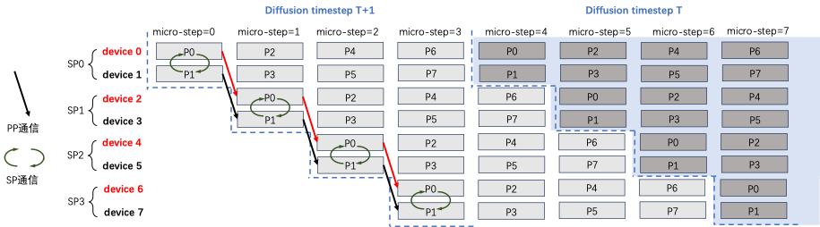

## 混合并行设计

xDiT设计目标是扩展推理过程到超大规模，比如异构网络互联条件下多机多卡，比如以太网和PCIe。单一并行方式，比如PipeFusion或者SP，很难同时做到这两点，不同并行方式混合在一起变得尤为重要。

xDiT支持四种并行方式：PipeFusion、Sequence、Data和CFG Parallel。其中，Data和CFG Parallel在图像间并行相对简单，而PipeFusion和Sequence在图像内部的不同Patch间并行则较为复杂。能让着两种并行方式的混合使用，正式xDiT核心创新点之一。

PipeFusion利用Input Tempor Redundancy特点，使用过时的KV（Stale KV）进行Attention计算，这使得PipeFusion无法像大型语言模型（LLM）那样轻松地实现并行策略的混合。具体来说，使用标准的序列并行接口，如RingAttention、Ulysses或USP，无法满足SP与PipeFusion混合并行的需求。

我们对这个问题具体说明，下图展示了pipe_degree=4，sp_degree=2的混合并行方法。设置`num_pipeline_patch`=4，图片切分为M=`num_pipeline_patch*sp_degree`=8个Patch，分别是P0~P7。

Standard SP Attention实现，输入Q，K，V和输出O都是沿着序列维度切分，且切分方式一致。如果不同rank的输入patch没有重叠，每个micro step计算出fresh KV更新的位置在不同rank间也没有重叠。如下图所示，standard SP的KV Buffer中黄色部分是SP0 rank=0拥有的fresh KV，绿色部分是SP1 rank=1拥有的fresh KV，二者并不相同。在这个diffusion step内，device=0无法拿到P1,3,5,7的fresh KV进行计算，但是PipeFusion则需要在下一个diffusion step中，拥有上一个diffusion step全部的KV。standard SP只拥有1/sp_degree的fresh kv buffer，因此无法获得混合并行推理正确的结果。

xDiT专门定制了序列并行的实现方式，以适应这种混合并行的需求。xDiT使用`xFuserLongContextAttention`把SP的中间结果存在KV Buffer内。这样效果如下图，每个micro-step SP执行完毕后，SP Group内不同rank设备的fresh KV是replicate的。这样一个diffusion step后，SP Group所有设备的KV Buffer都更新成最新，供下一个Diffusion Step使用。

