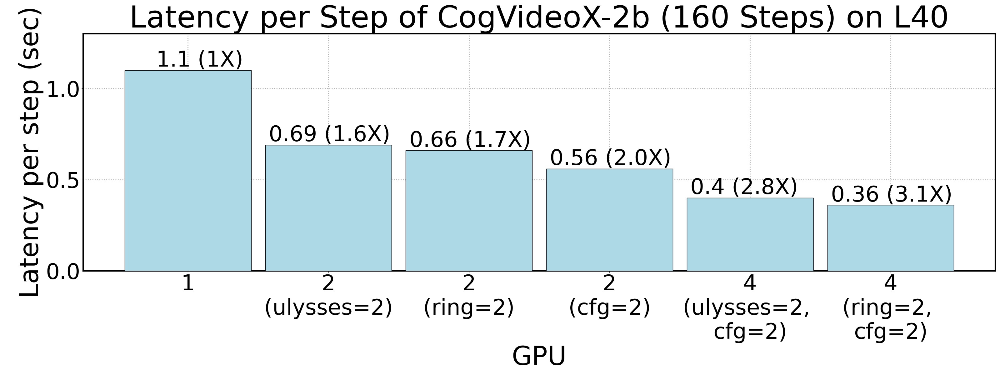
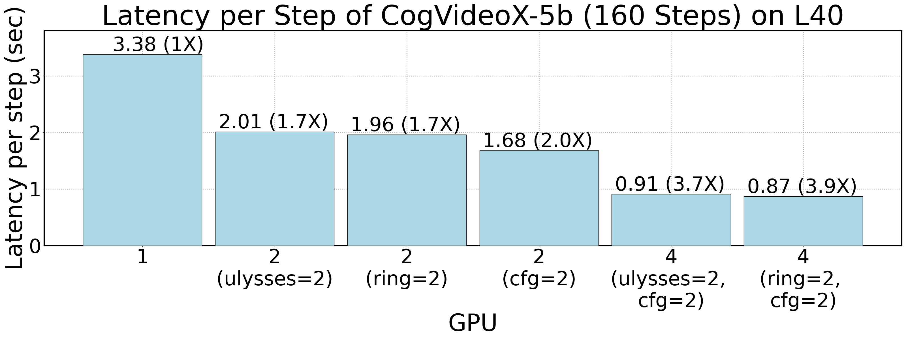

## CogVideo Performance
[Chinese Version](./cogvideo_zh.md)

CogVideo functions as a text-to-video model. xDiT presently integrates USP techniques (including Ulysses attention and Ring attention) and CFG parallelism to enhance inference speed, while work on PipeFusion is ongoing. Due to constraints in video generation dimensions in CogVideo, the maximum parallelism level for USP is 2. Thus, xDiT can leverage up to 4 GPUs to execute CogVideo, despite the potential for additional GPUs within the machine.

On a machine with L40 (PCIe) GPUs, we test the inference latency for generating a video with 30 frames, 720px with and 480px height with various DiT models.

The results for the CogVideoX-2b model are depicted in the following figure. As we can see, the latency decreases as the degree of parallelism grows. And xDiT achieves an up to 3.1X speedup over the original inference implementation in the `diffusers` package.

    

Similarly, as for the CogVideoX-5b model, xDiT achieves an up to 3.9X speedup.

    

