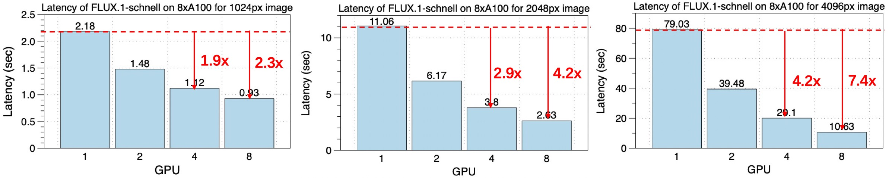
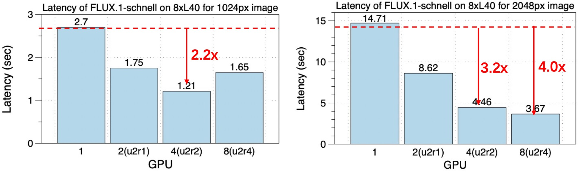
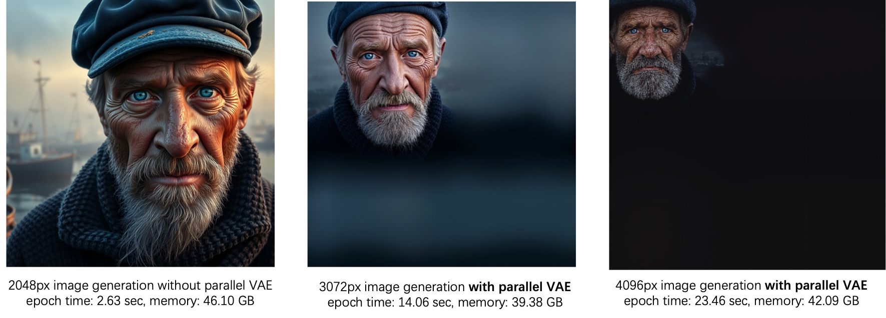

## Flux.1 Performance Overview
[Chinses Version](./flux_zh.md)

Flux.1, developed by Black Forest Labs and created by the original team behind Stable Diffusion, is a DiTs model featuring three variants: FLUX.1 [pro], FLUX.1 [dev], and FLUX.1 [schnell], all equipped with 12 billion parameters.

Deploying Flux.1 in real-time presents several challenges:

1. High Latency: Generating a 2048px image using the schnell variant with 4 sampling steps on a single A100 GPU takes approximately 10 seconds. This latency is significantly higher for the dev and pro versions, which require 30 to 50 steps.

2. VAE OOM: The VAE component experiences Out Of Memory (OOM) issues when attempting to generate images larger than 2048px on an A100 GPU with 80GB VRAM, despite the DiTs backbone's capability to handle higher resolutions.

To address these challenges, xDiT employs a hybrid sequence parallel [USP](https://arxiv.org/abs/2405.07719) and [VAE Parallel](https://github.com/xdit-project/DistVAE) to scale Flux.1 inference across multiple GPUs.

Currently, xDiT does not support PipeFusion for the Flux.1 schnell variant due to its minimal sampling steps, as PipeFusion requires a warmup phase which is not suitable for this scenario. However, applying PipeFusion for the Pro and Dev versions is considered necessary and is still under development.

Additionally, since Flux.1 does not utilize Classifier-Free Guidance (CFG), it is not compatible with cfg parallel.

### 扩展性展示

On an 8xA100 (80GB) GPUs interconnected via NVLink, the optimal strategy for USP is to allocate all parallelism to Ulysses. 
The latency of a 1024px image generation in just 0.93 seconds and a 2048px image in 2.63 seconds, achieving a 4.2x speedup compared to a single A100. 
The speedup is even more pronounced for higher resolution images, such as 4096px, where a 7.4x speedup is achieved.

    

On an 8xL40 GPUs interconnected via PCIe Gen4, xDiT also demonstrates significant acceleration at a 4-GPU scale. 
For a 1024px image, using a configuration with ulysses_degree=2 and ring_degree=2 results in lower latency compared to using Ulysses or ring alone, with an image generation time of 1.21 seconds. 
However, using 8 GPUs can actually slow down the process due to communication traffic going through QPI. 
For a 2048px image, an 8-GPU setup still achieves a 4x speedup.
 We anticipate that the integration of PipeFusion will enhance the scalability of the 8-GPU configuration.

    

### Effect of VAE Parallel

On an A100 GPU, using Flux.1 on a single card for resolutions above 2048px leads to an Out Of Memory (OOM) error. 
This is due to the increased memory requirements for activations, along with memory spikes caused by convolution operators, both of which collectively contribute to the issue.

By leveraging Parallel VAE, xDiT is able to demonstrate its capability for generating images at higher resolutions, enabling us to produce images with even greater detail and clarity. Applying `--use_parallel_vae` in the [runing script](../../examples/run.sh).

prompt是"A hyperrealistic portrait of a weathered sailor in his 60s, with deep-set blue eyes, a salt-and-pepper beard, and sun-weathered skin. He’s wearing a faded blue captain’s hat and a thick wool sweater. The background shows a misty harbor at dawn, with fishing boats barely visible in the distance."

The quality of image generation at 2048px, 3072px, and 4096px resolutions is as follows. It is evident that the quality of the 4096px generated images is significantly lower.

    

