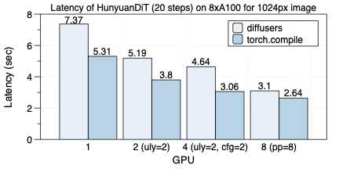
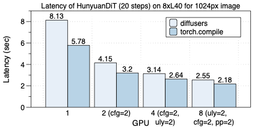
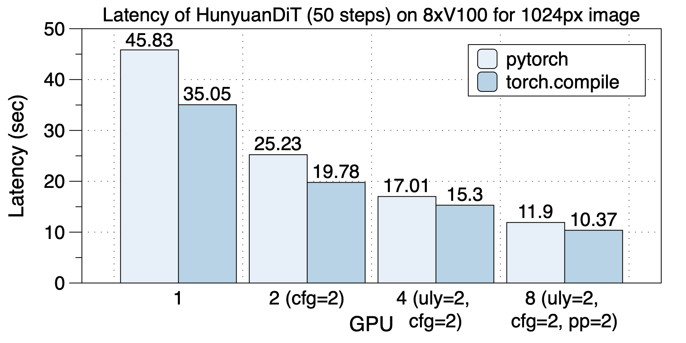
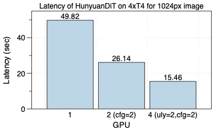

## HunyuanDiT性能

在8xA100（NVLink）机器上，在使用不同GPU数目时，最佳的并行方案都是不同的。这说明了多种并行和混合并行的重要性。
最佳的并行策略在不同GPU规模时分别是：在2个GPU上，使用`ulysses_degree=2`；在4个GPU上，使用`cfg_parallel=2, ulysses_degree=2`；在8个GPU上，使用`cfg_parallel=2, pipefusion_parallel=4`。

torch.compile带来的加速效果也很可观，同样并行方案有1.26x到1.76x加速效果，对于8 GPU的场景是最明显的，有1.76x加速。

    

在8xL40 (PCIe)上的延迟情况如下图所示。同样，不同GPU规模，最佳并行策略都是不同的。
和A100上不同，在L40上，8 GPU和4 GPU的延迟没有明显变化。我们认为是PCIe导致跨socket之间通信带宽过低导致的。

torch.compile带来1.2x到1.43x加速。

    

在8xV100上的加速下如下图所示。torch.compile带来1.10x到1.30x加速。

    

在4xT4上的加速下如下图所示。

    

