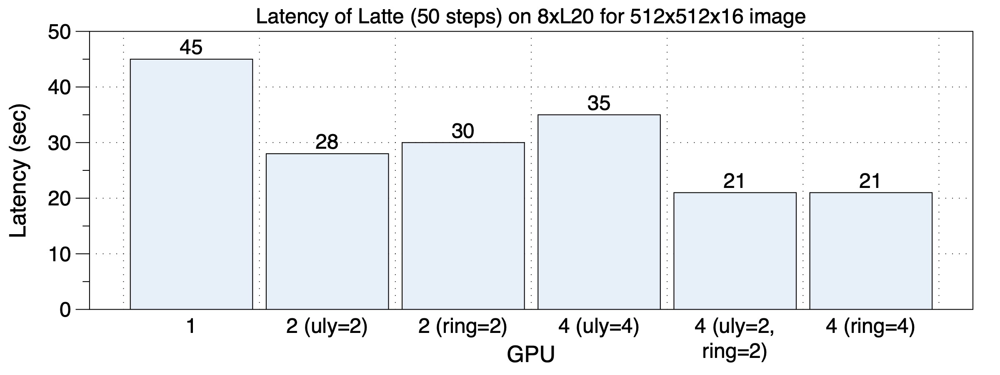
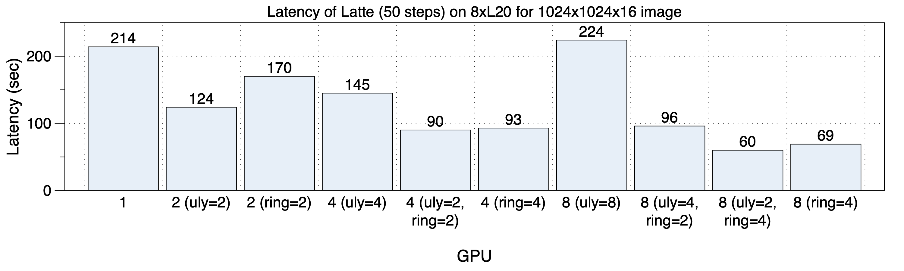

## Latte Performance
[Chinese Version](./latte_zh.md)

Latte is a text-to-video model, and xDiT currently implements parallel inference acceleration for it using the USP method. PipeFusion is under development.

On an 8xL20 (PCIe) machine, the latency performance for generating 512x512x16 videos is shown in the graph below.

    

The latency performance for generating 1024x1024x16 videos is depicted in the following graph. Using mixed sequence parallelization (`ulysses_degree=2`, `ring_degree=4`) yields the best performance.

    

