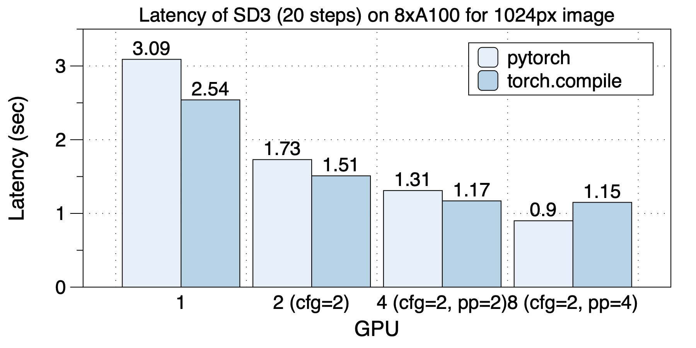
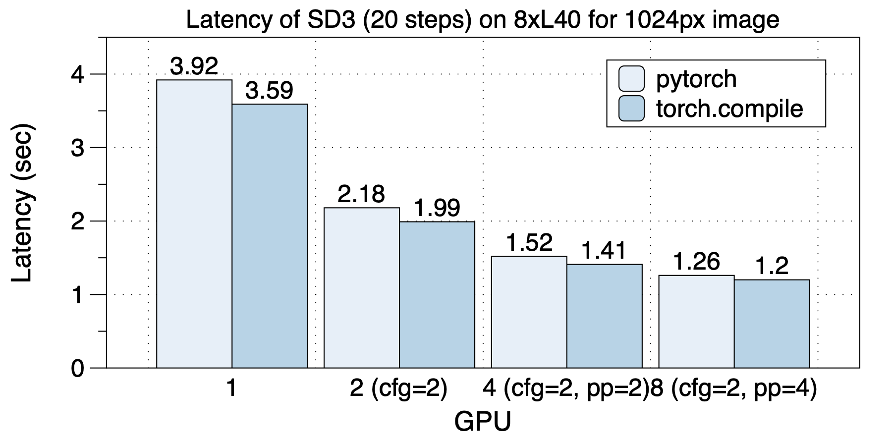

## Performance of Stable Diffusion 3
[Chinese Version](./sd3_zh.md)

We conducted performance evaluations using the open-source version of the stable-diffusion-3-medium-diffusers 2B model.

On an 8xA100 (NVLink) machine, the optimal parallelization strategy varied depending on the number of GPUs used, highlighting the importance of diverse and hybrid parallel approaches. The best parallel strategies for different GPU scales were as follows: with 2 GPUs, `cfg_parallel=2` was used; with 4 GPUs, `cfg_parallel=2, pipefusion_parallel=2` was employed; and with 8 GPUs, `cfg_parallel=2, pipefusion_parallel=4` was utilized.

torch.compile provided acceleration in all scenarios except for the 8 GPU configuration.

    

The latency situation on 8xL40 (PCIe) is depicted in the graph below. Similarly, the optimal parallel strategies varied with different GPU scales. torch.compile delivered acceleration in all cases.

    

